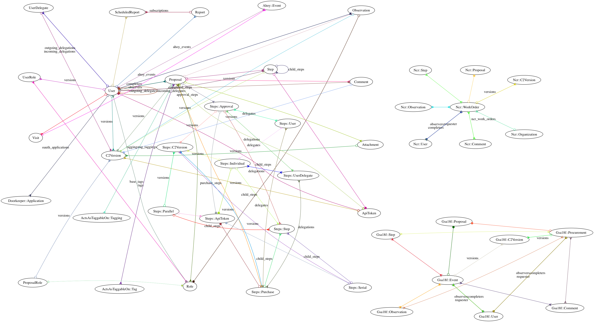

# Generating the model diagram



This image was created with [RailRoady](https://github.com/preston/railroady) and [Graphviz](http://www.graphviz.org). You can regenerate with:

1. Generate the graph as a DOT file.

    ```bash
    bundle exec railroady -o doc/models.dot -M -b
    ```

1. Do the following cleanup manually:
    * Fix the incorrect namespacing (see https://github.com/preston/railroady/issues/40)
    * Remove the `label`s on the edges
    * Tweak the graph parameters (see http://stackoverflow.com/questions/10438895/graphviz-outputs-a-mess for suggestions).

        ```
        digraph models_diagram {
          splines=true;
          sep="+35,35";
          overlap=false;
          nodesep=0.6;

          ...
        }
        ```

1. Generate the image with

    ```bash
    twopi -Tpng doc/models.dot > doc/models_brief.png
    ```
