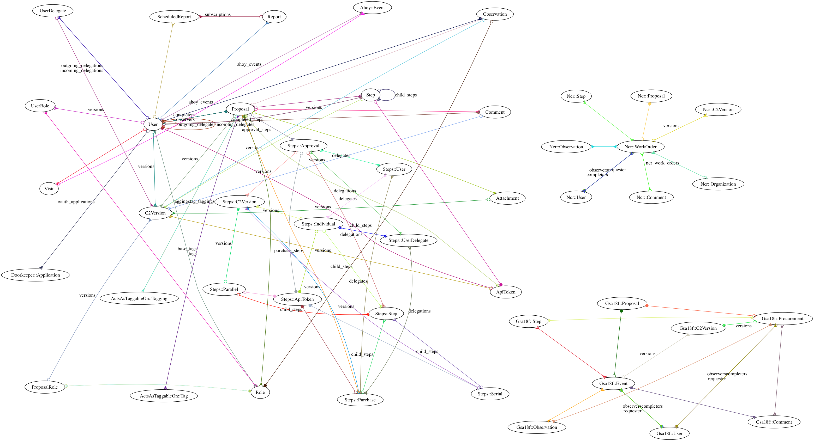
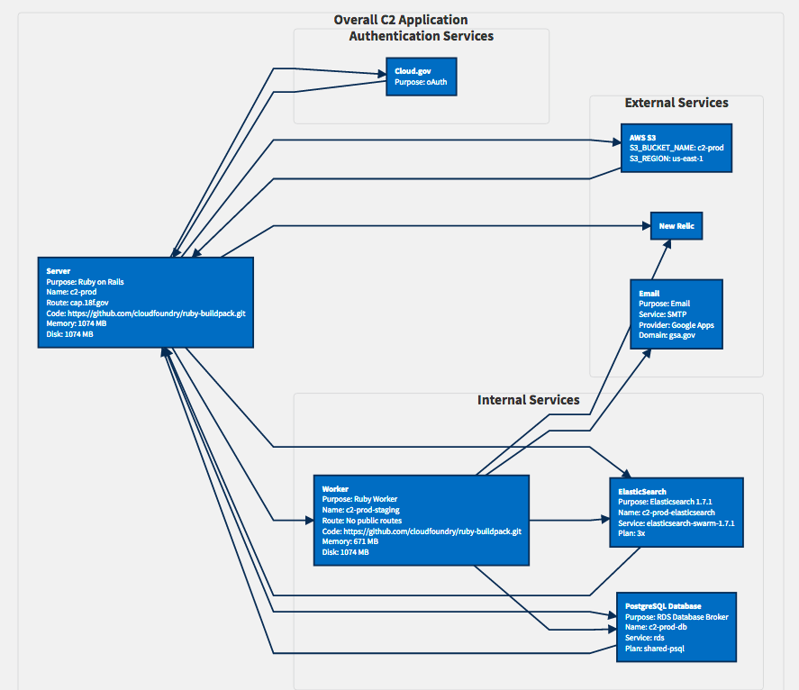

# Technical overview

C2 is, at its core, a state machine wrapped in email notifications. The system centers around Proposals, which are submitted by a "requester" and sent out to the "approvers" via email. Approvers can either ask questions or leave comments, then approve" the request. The requester (and any "observers") get notifications about the overall progress. Aside from receiving email notifications for updates, users can log in at any time and see the details for outstanding and past Proposals they were involved with.

The following diagram details the relationship between database models in the
app:



See [the model diagram page](models_diagram.md) for details about how to generate it.

## Architecture

The application is running on Cloud.gov's server infrustructure.



[Architecture flowchart is accessible in Mermaid](application_architecture.mmd).

### Hardware

The C2 application, hosted on cloud.gov, is running on a single server instance with 1024 MB of memory. There is a seperate identical server instance running a worker process to handle delayed_job tasks. The two instances are bound to a RDB shared PostgreSQL database and ElasticSearch instance using cloud.gov's service binding methods.

## Approval Chains

The order and requirements for a proposal to be "approved" are defined by an "approval chain". This is a hierarchical tree of `Approval` objects, with currently fall into three types:

* `Individual` - representing a single user's approving decision
* `Parallel` - whose children can approve in any order
* `Serial` - whose children must approve in sequence

The `Parallel` node has an additional configuration (`min_children_needed`), which allows it to require X out of Y approvals, for example requiring only a majority or only one of its children to approve.

The approval chains are designed so that the `Proposal` needs to only communicate with the _root_ of the chain. See the approval specs for examples.

## Emails

C2's main interface for most users is email. As a result, there are many cases where you may need to edit emails. The following will provide some basic understanding of the email logic to date.

[More information about them here](emails.md).

## User accounts

User records are created in C2 one of two ways:

* Via Cloud.gov, where they give C2 permission to use their email address via OAuth
* By being added as an approver or observer on a Proposal

They can then log in one of two ways:

* Via OAuth with Cloud.gov
* By clicking a link in a notification email, which contain a short-lived one-time-use token

### Roles

The system doesn't have any notion of user-level "roles", other than on a Proposal-by-Proposal basis. They can be one of:

#### Approver

A User who can approve a Proposal directly.

#### Delegate

A User who can approve Proposals on behalf of an approver. They can be added via the console with

```ruby
approver.add_delegate(other_user)
```

#### Observer

A User who gets notifications for and can comment on a Proposal.

#### Requester

The User who initiated a Proposal.

## Data types

You can see the up-to-date database schema in [`db/schema.rb`](../db/schema.rb).

## Use cases

This application contains code for several independent but similar use cases. Users will generally be segmented into one use case or another in terms of how the Proposals are initiated, though the approval workflow is (largely) the same. Learn about how they are structured code-wise (and how to add new ones) in our [developer guide](use_case_development.md).

### 18F Equipment

In the "old days", 18F staff would make requests for software and equipment via a spreadsheet that our Operations team lead would check periodically. The team is growing quickly and we now ask that employees get sign-off on their equipment/software requests from their manager before it goes to the Ops team, so are moving this process to C2. You will see references to `Gsa18f` throughout the code.

https://hub.18f.gov/request-supplies/

### [National Capital Region (NCR) service centers](http://www.gsa.gov/portal/content/104717)

The NCR use case was built around GSA service centers (paint shops, landscapers, etc.) needing approvals for their superiors and various budget officials for credit card purchases. They use the ["Serial" workflow](#approval-chains) where the steps include:

1. The requester logs in via Cloud.gov.
1. The requester submits a new purchase request via the form at `/ncr/work_orders/new`.
1. Their "approving officer" (the "AO" – their supervisor) receives an email notification with the request.
1. If the AO approves, it goes to one or two other budget office approvers, depending on the type of request.
  1. BA60 and BA61 requests go through two tiers of budget approvals. Tier One verifies the budget coding for a request
     and adds the codes (Soc/Func) into the request. Tier Two budget approvers do final approval, which includes
     verifying that there are funds available.
  1. Any BA60 or BA61 request from the White House Service Center, indicated with the appropriate org code,
     bypasses the Tier One approval.
1. Once all approvers have approved the Proposal, the requester gets a notification.

#### Additional resources

* [GSA CFO Financial Systems & Resources Glossary](https://insite.gsa.gov/portal/content/537294) (only visible on GSA network)

## Performance

C2 has the [Peek](https://github.com/peek/peek) performance bar loaded in development, and in production for admins. It's hidden by default – press the backtick (`` ` ``) key to display it.

## Supported Browsers

Support Level         |   Browsers In Level       | Bugs Will Be... |
----------------------|-------------------|-------------|
Level 1 | Internet Explorer 9, Chrome  | resolved with high priority |
Level 2 | Firefox, Opera, Safari, Internet Explorer 10, Internet Explorer 11 | resolved with low priority |
Level 3 | Internet Explorer 6, 7, 8, and all mobile and tablet browsers | not resolved |
